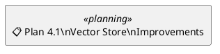
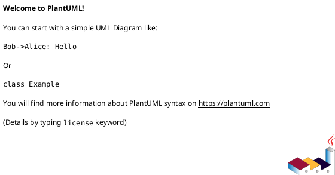

# GUIDE-1.4 - Documentation & Visualization Standards - CORE

**Version:** 1.4
**Date:** 2026-01-09  
**Status:** Active  
**Fragment:** CORE - Overview, Why PlantUML, Accessibility
**Scope:** Markdown documentation standards with integrated PlantUML diagrams

---

## Overview

This guide establishes comprehensive standards for documentation and visualization across all project documentation using PlantUML diagrams embedded in markdown files.

### Why PlantUML?

- ✅ **Free and Open Source** - no licensing costs, community-driven
- ✅ **AI-friendly syntax** - clear, readable, easily understandable by AI
- ✅ **Native Markdown support** - embedded in `.md` files with triple-backtick fences
- ✅ **Wide rendering support** - GitHub, GitLab, Notion, VS Code extensions
- ✅ **Version-controllable** - human-readable source in git
- ✅ **Powerful features** - sprites, skinparams, advanced styling
- ✅ **Multiple export formats** - PNG, SVG, ASCII art

---

## PlantUML Syntax: Basic Patterns

### ✅ Rectangle Diagrams with Stereotypes

**PlantUML uses stereotypes (<<...>>) to apply styles:**

```plantuml
@startuml
rectangle "📋 Plan 1.4" <<planning>> as Plan
rectangle "Phase 1.4.1" <<inProgress>> as Phase1
rectangle "Phase 1.4.2" <<planning>> as Phase2

Plan --> Phase1
Plan --> Phase2

skinparam rectangle<<planning>> {
    BackgroundColor #e1f5ff
    BorderColor #01579b
    FontColor #01579b
    BorderThickness 2
}

skinparam rectangle<<inProgress>> {
    BackgroundColor #fff9c4
    BorderColor #f57f17
    FontColor #f57f17
    BorderThickness 2
}
@enduml
```



**Rules:**

1. Define rectangles with stereotypes: `rectangle "Label" <<stereotype>> as ID`
2. Define connections using IDs: `ID1 --> ID2`
3. Define skinparam styles at the beginning or end of diagram

### ✅ Multi-line Labels

**Use \\n for line breaks in PlantUML:**



---

##Accessibility & Best Practices

### WCAG Compliance Checklist

- ✅ **Text Contrast Ratio:** All colors meet WCAG AA (4.5:1) minimum
- ✅ **Dark text on light backgrounds** for readability
- ✅ **Thick borders** (2px) for visual clarity
- ✅ **Emoji Usage:** Provides visual icons beyond color alone
- ✅ **Color-Blind Safe:** Dark text + emoji = readable for all color blindness types

### Contrast Verification

Use [WebAIM Contrast Checker](https://webaim.org/resources/contrastchecker/):

- Complete (Green) + Dark Green = **7.42:1** ✅ AAA
- In Progress (Yellow) + Orange = **5.32:1** ✅ AA
- Planning (Blue) + Dark Blue = **8.12:1** ✅ AAA
- Testing (Light Blue) + Navy = **6.84:1** ✅ AAA
- Blocked (Pink) + Dark Red = **7.18:1** ✅ AAA

### Node Labeling Rules

- ✅ Always include emoji in labels for visual recognition
- ✅ Keep text concise (max 3 lines per node)
- ✅ Use `\\n` for line breaks in labels
- ✅ Use consistent terminology across diagrams
- ✅ Start with stereotype, then define connections

---

## PlantUML Diagram Types Reference

### Common Diagram Types for Project

| Type | PlantUML Syntax | Use Case |
| :-- | :-- | :-- |
| Component | `@startuml` with `[...]`, `package` | Architecture, module dependencies |
| Class | `@startuml` with `class` | MVVM, OOP relationships |
| Sequence | `@startuml` with `participant`, `->` | Async flows, logging pipeline |
| Activity | `@startuml` with `start`, `:activity;` | Business logic, workflows |
| State | `@startuml` with `state` | UI states, app lifecycle |
| Deployment | `@startuml` with `node`, `artifact` | Infrastructure, CI/CD |

### Advanced PlantUML Features

**Grouping with packages:**

```plantuml
package "UI Layer" {
    [Component1]
    [Component2]
}
```

**Notes and comments:**

```plantuml
@startuml
' 1. Először definiáld a komponenst (ez Component módba váltja a parsert)
[Component1]

' 2. Utána már hivatkozhatsz rá
note left of [Component1] : This is important

' 3. A "note right" az utolsó elemre vonatkozik, vagy írd ki explicit
note right of [Component1] : Multi-line\\nnote example
@enduml
```



**Conditional flows:**

```plantuml
if (condition?) then (yes)
    :Action A;
else (no)
    :Action B;
endif
```

---

## Troubleshooting: Common PlantUML Errors

### Error: Syntax error in line X

**Cause:** Missing `@startuml` or `@enduml` tags

**✅ Fixed:**



### Error: Cannot find skin parameter

**Cause:** Typo in skinparam or stereotype name

**✅ Check spelling:**

```plantuml
skinparam rectangle<<myStyle>> {
    ' ...
}
rectangle "Label" <<myStyle>>
```

### Error: Shapes not rendering correctly

**Cause:** Missing quotes around labels with special characters OR mixing explicit `component` with bracket notation.

**✅ Always use quotes & bracket notation:**

```plantuml
[Component 1] --> [Component 2]
rectangle "Text with 'quotes' & special" as Node1
```

---

## Related Guides

- See **[GUIDE--visualization-plantuml-styling.md](GUIDE--visualization-plantuml-styling.md)** for skinparams and color palettes
- See **[GUIDE--visualization-plantuml-patterns.md](GUIDE--visualization-plantuml-patterns.md)** for diagram patterns and templates

---

**Fragment Status:** This is the CORE fragment covering PlantUML basics, accessibility, and troubleshooting.
