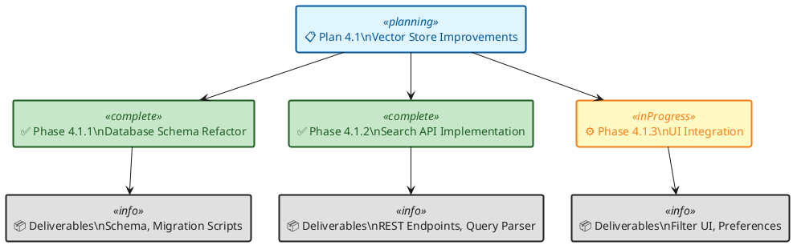
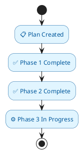
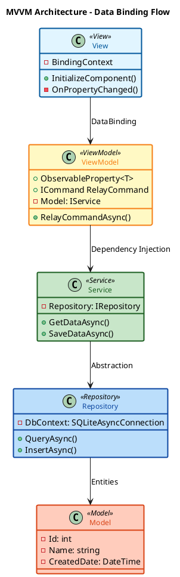
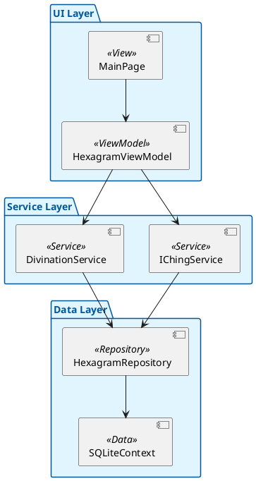
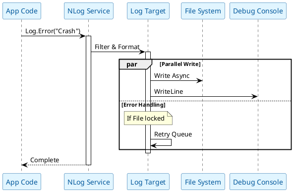
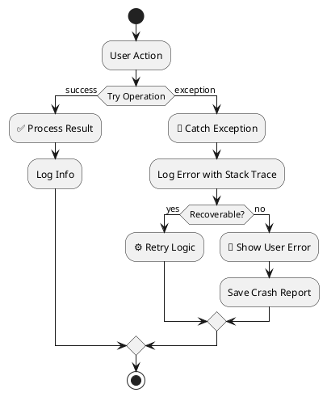
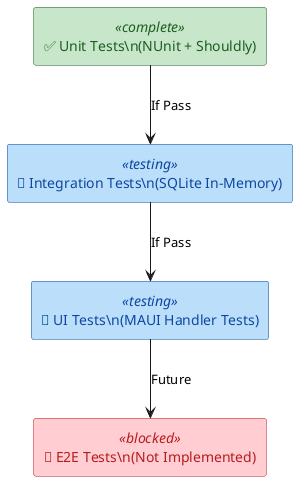

# GUIDE-1.4 - Documentation & Visualization Standards - PATTERNS

**Version:** 1.4
**Date:** 2026-01-09  
**Status:** Active  
**Fragment:** PATTERNS - Diagram Patterns for Plans, Architecture, Testing
**Scope:** Reusable PlantUML patterns for different use cases

---

## Part 1: Plan Phase Versioning with PlantUML

### 1.1 Plan Hierarchy Diagram

**Purpose:** Show parent plan and child phases relationship
**Best for:** Feature plans, test case investigations
**Diagram Type:** Rectangle diagram (hierarchy)

#### Standard Feature Plan Hierarchy

### 1.2 Timeline Diagram

**Purpose:** Show chronological progression of phases
**Best for:** Release planning, sprint timelines
**Diagram Type:** Activity diagram (timeline)

---

## Part 2: Coding Conventions & Architecture

### 2.1 MVVM Architecture Diagram

**Purpose:** Show Model-View-ViewModel relationships and data flow
**Best for:** MAUI architecture documentation
**Diagram Type:** Class diagram

#### MAUI MVVM Pattern with Dependency Injection

### 2.2 Class Dependency Diagram (CORRECTED)

**Purpose:** Show class relationships and dependencies
**Best for:** Refactoring documentation, architecture reviews
**Correction:** **Uses Bracket Notation `[...]` instead of explicit `component` keyword.**

---

## Part 3: Logging & Diagnostics

### 3.1 NLog Processing Pipeline

**Purpose:** Show how log messages flow through NLog targets
**Best for:** Logging architecture documentation
**Diagram Type:** Sequence diagram

#### NLog Event Processing

### 3.2 Error Handling Flow

**Purpose:** Show exception handling and recovery flow
**Best for:** Error handling documentation

---

## Part 4: Testing & CI/CD

### 4.1 Test Execution Flow

**Purpose:** Show test execution pipeline
**Best for:** Testing strategy documentation

---

## Related Guides

- See **[GUIDE--visualization-plantuml-core.md](GUIDE--visualization-plantuml-core.md)** for PlantUML basics and accessibility
- See **[GUIDE--visualization-plantuml-styling.md](GUIDE--visualization-plantuml-styling.md)** for skinparams and color palettes

---

**Fragment Status:** This is the PATTERNS fragment covering reusable diagram patterns for plans, architecture, logging, and testing.
