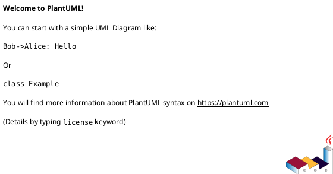
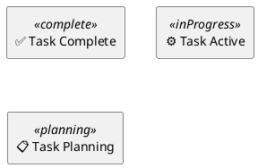

# GUIDE-1.4 - Documentation & Visualization Standards - STYLING

**Version:** 1.4
**Date:** 2026-01-09  
**Status:** Active  
**Fragment:** STYLING - Skinparams, Color Palettes, Templates
**Scope:** Color standards and skinparam templates for consistent diagram styling

---

## Color Palette Standards (HIGH CONTRAST - WCAG AA)

### Standard Status Colors with Readable Text

**🔑 Key Requirement:** Text colors meet WCAG AA accessibility standard (4.5:1 contrast ratio minimum). All backgrounds have dark text for readability.

| Status | BG Hex | Text Hex | Text Color | WCAG | Usage |
|--------|--------|----------|-----------|------|----------|
| ✅ Complete/Success | `#c8e6c9` | `#1b5e20` | Dark Green | ✅ AA | Done items, passed tests |
| ⚙️ In Progress/Active | `#fff9c4` | `#f57f17` | Orange | ✅ AA | Current work, ongoing |
| 📋 Planning/Pending | `#e1f5ff` | `#01579b` | Dark Blue | ✅ AA | Not started, planned |
| 🧪 Testing/Review | `#bbdefb` | `#0d47a1` | Navy Blue | ✅ AA | QA phase, code review |
| 🚧 Blocked/Issue | `#ffcdd2` | `#b71c1c` | Dark Red | ✅ AA | Blocked, critical issue |
| 🐛 Bug/Error | `#ffccbc` | `#d84315` | Dark Orange | ✅ AA | Bug fixes, errors |
| 🚀 Deploy/Release | `#a5d6a7` | `#1b5e20` | Dark Green | ✅ AA | Production deployments |
| ⓘ Info/Reference | `#e0e0e0` | `#212121` | Dark Gray | ✅ AAA | Neutral, reference |

### Applying High Contrast Colors in PlantUML

**CRITICAL:** All diagrams MUST include skinparam styles for readability and consistency.

```plantuml
@startuml
skinparam backgroundColor white
skinparam defaultFontName Arial
skinparam defaultFontSize 12

' Complete status styling
skinparam rectangle<<complete>> {
    BackgroundColor #c8e6c9
    BorderColor #1b5e20
    FontColor #1b5e20
    BorderThickness 2
}

' In Progress status styling
skinparam rectangle<<inProgress>> {
    BackgroundColor #fff9c4
    BorderColor #f57f17
    FontColor #f57f17
    BorderThickness 2
}

' Planning status styling
skinparam rectangle<<planning>> {
    BackgroundColor #e1f5ff
    BorderColor #01579b
    FontColor #01579b
    BorderThickness 2
}

' Testing status styling
skinparam rectangle<<testing>> {
    BackgroundColor #bbdefb
    BorderColor #0d47a1
    FontColor #0d47a1
    BorderThickness 2
}

' Blocked status styling
skinparam rectangle<<blocked>> {
    BackgroundColor #ffcdd2
    BorderColor #b71c1c
    FontColor #b71c1c
    BorderThickness 2
}

rectangle "✅ Complete" <<complete>>
rectangle "⚙️ In Progress" <<inProgress>>
rectangle "📋 Planning" <<planning>>
rectangle "🧪 Testing" <<testing>>
rectangle "🚧 Blocked" <<blocked>>
@enduml
```



### Copy-Paste Reference: Full Skinparam Set

Use this template for ALL PlantUML diagrams to ensure consistency:

```plantuml
@startuml
skinparam backgroundColor white
skinparam defaultFontName Arial
skinparam defaultFontSize 12
skinparam shadowing false

' Status colors - WCAG AA compliant
skinparam rectangle<<complete>> {
    BackgroundColor #c8e6c9
    BorderColor #1b5e20
    FontColor #1b5e20
    BorderThickness 2
}

skinparam rectangle<<inProgress>> {
    BackgroundColor #fff9c4
    BorderColor #f57f17
    FontColor #f57f17
    BorderThickness 2
}

skinparam rectangle<<planning>> {
    BackgroundColor #e1f5ff
    BorderColor #01579b
    FontColor #01579b
    BorderThickness 2
}

skinparam rectangle<<testing>> {
    BackgroundColor #bbdefb
    BorderColor #0d47a1
    FontColor #0d47a1
    BorderThickness 2
}

skinparam rectangle<<blocked>> {
    BackgroundColor #ffcdd2
    BorderColor #b71c1c
    FontColor #b71c1c
    BorderThickness 2
}

skinparam rectangle<<bugError>> {
    BackgroundColor #ffccbc
    BorderColor #d84315
    FontColor #d84315
    BorderThickness 2
}

skinparam rectangle<<success>> {
    BackgroundColor #a5d6a7
    BorderColor #1b5e20
    FontColor #1b5e20
    BorderThickness 2
}

skinparam rectangle<<info>> {
    BackgroundColor #e0e0e0
    BorderColor #212121
    FontColor #212121
    BorderThickness 2
}
@enduml
```

---

## Implementation Rules for AI & Users

### When Creating Diagrams - FOLLOW THIS PATTERN

**Step 1: Start diagram with @startuml**



**Step 2: Define skinparam styles first**

```plantuml
@startuml

skinparam backgroundColor white
skinparam rectangle<<complete>> {
    BackgroundColor #c8e6c9
    BorderColor #1b5e20
    FontColor #1b5e20
    BorderThickness 2
}
@enduml
```

**Step 3: Define all nodes with stereotypes**



**Step 4: Define all connections**

```plantuml
TaskA --> TaskB
TaskB --> TaskC
```

**Step 5: Close diagram**

```plantuml
'Start with @startuml tag
@startuml

@enduml
```

### Complete Template (Copy & Paste)

```plantuml
@startuml
skinparam backgroundColor white
skinparam defaultFontName Arial
skinparam shadowing false

' Define styles
skinparam rectangle<<complete>> {
    BackgroundColor #c8e6c9
    BorderColor #1b5e20
    FontColor #1b5e20
    BorderThickness 2
}

skinparam rectangle<<inProgress>> {
    BackgroundColor #fff9c4
    BorderColor #f57f17
    FontColor #f57f17
    BorderThickness 2
}

skinparam rectangle<<planning>> {
    BackgroundColor #e1f5ff
    BorderColor #01579b
    FontColor #01579b
    BorderThickness 2
}

' Define nodes
rectangle "✅ Task Complete" <<complete>> as TaskA
rectangle "⚙️ Task Active" <<inProgress>> as TaskB
rectangle "📋 Task Planning" <<planning>> as TaskC

' Define connections
TaskA --> TaskB
TaskB --> TaskC
@enduml
```



---

## Related Guides

- See **[GUIDE--visualization-plantuml-core.md](GUIDE--visualization-plantuml-core.md)** for PlantUML basics and accessibility
- See **[GUIDE--visualization-plantuml-patterns.md](GUIDE--visualization-plantuml-patterns.md)** for diagram patterns and templates

---

**Fragment Status:** This is the STYLING fragment covering color palettes, skinparams, and diagram templates.
