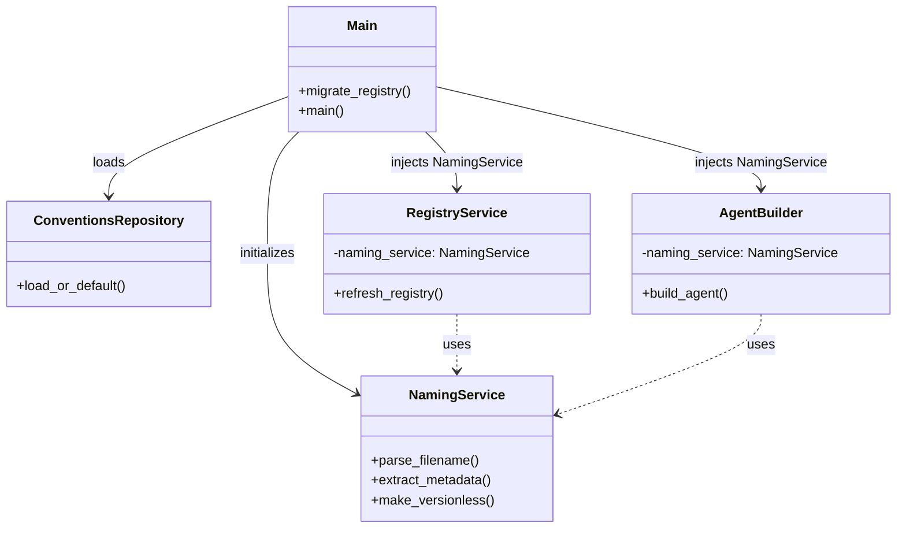

# 🚀 Context Transfer: AIPromptManager

## 📍 Where We Are (Status)

* **Current Phase:** Phase 3.1 (Intelligent Rename)
* **Last Completed:** Completed Phase 3.1 implementation. Naming is now configurable via `.apm/conventions.json`.
* **In Progress:** None (Session Wrap-up).
* **Next Up:** Potential UI enhancements for custom naming or Phase 4 (Advanced Workflows).

## 📝 Task Status (`task.md` Snapshot)

```markdown
# Phase 3.1: Intelligent Rename Implementation

## Planning ✅
- [x] Gap analysis complete
- [x] Implementation plan approved
- [x] User clarifications incorporated (.apm folder, subtypes, warnings)

## Implementation ✅
- [x] Models: ConventionsSchema, FileNaming
- [x] Repository: ConventionsRepository
- [x] Service: NamingService
- [x] Refactor: RegistryService (use NamingService with legacy fallback)
- [x] Refactor: AgentBuilder (use NamingService with legacy fallback)
- [x] Migration: Auto-move registry.json to .apm/ on startup
- [x] Sample Data: Moved to .apm/ folder structure
- [x] UI: Added startup warning display in status bar

## Testing ✅
- [x] New tests: conventions_schema (11 tests)
- [x] New tests: naming_service (19 tests)
- [x] New tests: conventions_repository (13 tests)
- [x] Existing tests: All 87 passing (backward compatible)

## Verification ✅
- [x] pytest passes: **130 tests total**
- [x] mypy --strict passes: **no issues in 25 files**
- [ ] Manual UI verification (optional)
```

## 🧠 Key Context & Decisions

* **Unified Config:** All metadata/config now resides in `{data_dir}/.apm/`.
* **Configurable Naming:** `NamingService` uses patterns from `conventions.json`.
* **Subtype Support:** Supports `TYPE_SUB-V-Basename.md` where `TYPE_SUB` is categorized by its parent `TYPE` (underscore separator).
* **Backward Compatibility:** Services still work without an injected `NamingService` using legacy internal constants.
* **Migration:** Existing `registry.json` files are automatically moved to `.apm/` on startup.

## 📂 Hot Files (To Open First)

* `src/services/naming_service.py`
* `src/models/conventions_schema.py`
* `src/main.py` (wiring and migration logic)

## ⏭️ Prompt for Next Session

> "I am continuing work on AIPromptManager. We just completed Phase 3.1 (Intelligent Rename) and are ready to move forward.
> Please review the attached `task.md` and the 'Hot Files' listed above.
>
> **Immediate Goal:** Verify the new naming conventions with custom patterns and plan next steps (Phase 4)."

## 🏗️ Architecture Visualization


