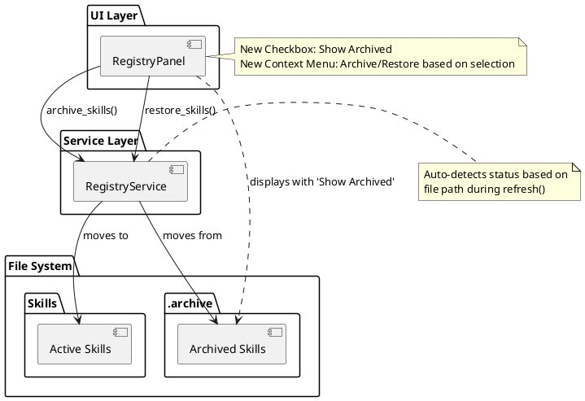

# 🚀 Context Transfer: AIPromptManager

## 📍 Where We Are (Status)

* **Current Phase:** Phase 3.4: New Features (Archive UI Completed)
* **Last Completed:** Implemented Archive/Restore logic, UI components, and fixed verify filtering/auto-detection bugs.
* **In Progress:** Transitioning to next feature.
* **Next Up:** Move Files to Folder (Service + Dialog + UI).

## 📝 Task Status (`task.md` Snapshot)

```markdown
# Phase 2: Archive/Restore UI

- [x] Implement Archive UI Components
  - [x] Bugfix: Archive filter consistency (unrelated items disappearing)
- [x] Bugfix: File system auto-detection of archived files
- [x] Update Project READMEs with new features
- [x] Finalize all checks (Tests, Mypy, Black)
  - [x] Add visual indicators for archived skills
- [x] Verify UI Implementation
  - [x] Manual verification of Archive/Restore flow
```

## 🧠 Key Context & Decisions

* **Plan:** Following locally defined `doc/plans/PLAN-Phase3.4-NewFeatures.md`.
* **Architecture:** `RegistryPanel` now handles archive filtering via `_apply_filter_and_sort`.
* **Service Layer:** `RegistryService` automatically detects archived status based on file path (starts with `.archive/`), allowing manual FS operations to be reflected in UI.
* **Environment:** `.vscode/launch.json` now includes `SEQ_URL` to match `apm.bat`.
* **Testing:** strict `mypy` compliance verified; `tests/test_registry_panel_archive.py` added.

## 📂 Hot Files (To Open First)

* `doc/plans/PLAN-Phase3.4-NewFeatures.md` (The Master Plan)
* `src/ui/registry_panel.py` (Core UI logic)
* `src/services/registry_service.py` (Backend status logic)

## ⏭️ Prompt for Next Session

> "I am continuing work on Phase 3.4: New Features. We just completed the Archive/Restore UI.
> Please review the attached `task.md` and the master plan at `doc/plans/PLAN-Phase3.4-NewFeatures.md`.
>
> **Immediate Goal:** Implement the **Move Files to Folder** feature (Service + Dialog + UI) as per step 3 of the execution plan."

## 🏗️ Visualization (Current State)


