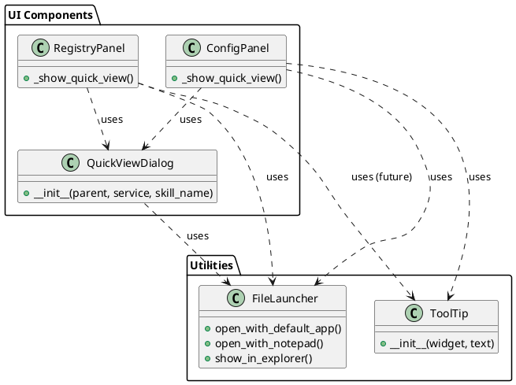

# 🚀 Context Transfer: AIPromptManager

## 📍 Where We Are (Status)

* **Current Phase:** Phase 3.4 (New Features)
* **Last Completed:** Refactor Quick View to Shared Component & DRY Utilities
* **In Progress:** Ready to start "Compare with Merge Tool"
* **Next Up:** Implement Merge Tool Settings & Compare Dialog

## 📝 Task Status (`task.md` Snapshot)

```markdown
- [x] Implement H1 Edit in Quick View
- [x] Fix Quick View Issues
- [x] Refactor Quick View to Shared Component
- [x] Refactor Utilities (DRY)
  - [x] Create `FileLauncher` in `src/utils/`
  - [x] Create `ToolTip` in `src/ui/widgets/`
  - [x] Refactor `QuickViewDialog` usage
  - [x] Refactor `RegistryPanel` usage
  - [x] Refactor `ConfigPanel` usage
- [ ] Compare with Merge Tool
  - [ ] Implement Settings Dialog
  - [ ] Implement Compare Dialog
  - [ ] Integrate with Registry Panel
```

## 🧠 Key Context & Decisions

* **Architecture Change:** Quick View logic is no longer inline in panels. It uses `src/ui/dialogs/quick_view_dialog.py`.
* **DRY Utilities:**
  * `src/utils/file_launcher.py`: Centralized file opening (Notepad, Editor, Explorer).
  * `src/ui/widgets/tooltip.py`: Shared tooltip component.
* **UI Consistency:** Both `RegistryPanel` and `ConfigPanel` now share the exact same Quick View implementation.

## 📂 Hot Files (To Open First)

* `src/ui/registry_panel.py`
* `src/ui/config_panel.py`
* `src/ui/dialogs/quick_view_dialog.py`
* `src/utils/file_launcher.py`
* `doc/plans/PLAN-Phase3.4-NewFeatures.md`

## 🏗️ Visualization (Current State)



## ⏭️ Prompt for Next Session

> "I am continuing work on Phase 3.4. We just completed the 'Quick View Refactor' and 'DRY Utilities' tasks.
> Please review the attached `task.md` and the 'Hot Files' listed above.
>
> **Immediate Goal:** Start implementing the 'Compare with Merge Tool' feature as outlined in `PLAN-Phase3.4-NewFeatures.md` (Section 4). This involves creating `CompareDialog` and `SettingsDialog`."
