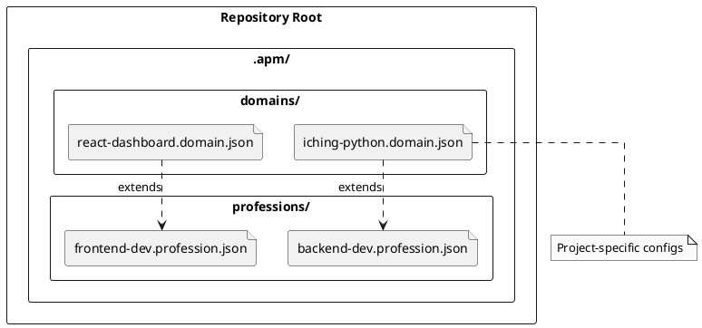

# 🚀 AIPromptManager: Status & Roadmap

**Last Updated:** 2026-01-22
**Current Version:** Phase 3.3a (Complete)
**Upcoming:** Phase 3.4 (New Features & Architecture)

This document serves as a unified source of truth for the project's history, current state, and planned architectural decisions.

---

## 🏗️ 1. Project Overview

AIPromptManager is a desktop application designed to manage, version, and assemble AI prompts for agentic workflows. It allows users to maintain a "Registry" of skills (prompts) and combine them into "Professions" (configurations) for specific agents.

### Core Terminology

| Term | Definition |
|------|------------|
| **Skill** | A single reusable asset (Guide, Space, Prompt) stored as a Markdown file. |
| **Registry** | The collection of all available skills scanned from the filesystem. |
| **Profession** | A configuration defining a specific role (e.g., "Backend Developer"), consisting of a selected set of skills. |
| **Domain** | *(Planned)* A specialized extension of a profession (e.g., "Backend Developer + I-Ching Expert"). |

---

## ✅ 2. Current Implementation (Phase 3.3a)

We have just completed **Phase 3.3a: Registry Filesystem View**. The focus was on "Permissive Registry" logic—ensuring the application sees *what is actually on disk* rather than enforcing strict naming conventions that hide files.

### Key Features Implemented

* **Permissive Scanning:** `RegistryService` now tracks ALL `.md`, `.yaml`, and `.yml` files in scanned directories, even if they don't match the standard `TYPE-Major-Minor-Name.md` convention.
* **Intelligent Metadata Extraction:**
    1. **Filename Pattern:** Tries to parse standard strict name.
    2. **H1 Heading:** If filename fails, looks for `# Title (v1.0)` in the file content.
    3. **Frontmatter:** If that fails, checks YAML frontmatter.
    4. **Defaults:** Fallback to filename stem and version `0.0`.
* **Status System:** Every Skill now has a status indicator:
  * `VALID` (✅): Matches all conventions.
  * `UNRECOGNIZED` (⚠️): Found on disk but violates naming rules (safe to use).
  * `PARSE_ERROR` (❌): File exists but metadata could not be read.
  * `ARCHIVED` (📦): File is located in the `.archive/` directory.

### Codebase Highlights

* **`src/models/skill.py`**: Updated `Skill` dataclass with `status` and `status_detail` fields.
* **`src/services/registry_service.py`**:
  * `refresh_registry()`: New scan loop for permissive tracking and archive detection.
  * `_extract_metadata_intelligently()`: Hierarchy of extraction strategies.
* **`src/ui/registry_panel.py`**: Visual indicators (icons, colors) in the Knowledge Base list.

---

## 🏛️ 3. Architectural Design Decisions

The following decisions have been made for the upcoming **Phase 3.4** and beyond.

### 3.1 Profession & Domain Storage

To support project-specific configurations, we will adopt a structured approach within the AI library repository.

**Location:** `.apm/` folder in the root of the library (e.g., `AIPromptManager/.apm/`).

**Structure:**

* **`professions/`**: Contains "Base Roles".
  * Example: `backend-dev.profession.json`
  * Includes: Core skills (coding standards, git) + Platform skills (Python, Docker).
* **`domains/`**: Contains "Specialized Extensions".
  * Example: `iching-python.domain.json`
  * **Extends**: `backend-dev` (Inherits all skills from the profession).
  * **Includes**: Domain-specific skills (I-Ching Hexagrams logic, specific library docs).
* **User Workflow**: A user's project will reference a single **Domain** file, which transitively includes the Profession and all necessary Skills.

### 3.2 Archive System

Deleted skills are not effectively removed; they are moved to an Archive.

* **Directory:** `.archive/` (hidden folder in repo root).
* **Structure:** Mirrors the original directory structure.
  * Original: `prompts/coding/PROMPT-1-0-Refactor.md`
  * Archived: `.archive/prompts/coding/PROMPT-1-0-Refactor.md`
* **Behavior:** Archived skills are hidden by default but can be toggled visible. They are read-only until restored.

---

## 🗺️ 4. Roadmap (Phase 3.4 & Beyond)

### Phase 3.4: New Features (Planned)

| Feature | Description | Priority |
|---------|-------------|----------|
| **Archive/Restore Service** | Backend logic to move files to/from `.archive/` and update registry status. | High |
| **Move Files** | Right-click "Move to Folder..." to reorganize skills into directories. | Medium |
| **Quick View Editing** | Allow editing the H1 title directly in the Quick View popup. | Low |
| **Comparison Tool** | Integration with external merge tools (P4Merge, WinMerge) for 2-way/3-way diffs. | Medium |
| **Settings Dialog** | Configuration for external tools and application defaults. | Medium |

### Phase 3.5: Editor Integration

* **"Open with..."**: Integration with VS Code, Notepad++, etc.
* **Live Reload**: Watchdog observer to auto-refresh registry on file changes (no manual Refresh needed).

### Phase 4.0: Project Generation

* **`agent.config.json` Generation**: The final step where the selected Domain + Profession is compiled into the `.agent/rules` for the user's project.
* **Conflict Detection**: Warning if multiple skills define conflicting instructions.

---

## 📂 Key Documentation Links

* [Phase 3.4 Plan](file:///c:/Git/AIPromptManager/doc/plans/PLAN-Phase3.4-NewFeatures.md)
* [State Snapshot (2026-01-20)](file:///c:/Git/AIPromptManager/doc/plans/state_20260120_transfer.md)
* [Getting Started Guide](file:///c:/Git/AIPromptManager/sample_data/prompts/GUIDE-1-0-Getting-Started.md)
