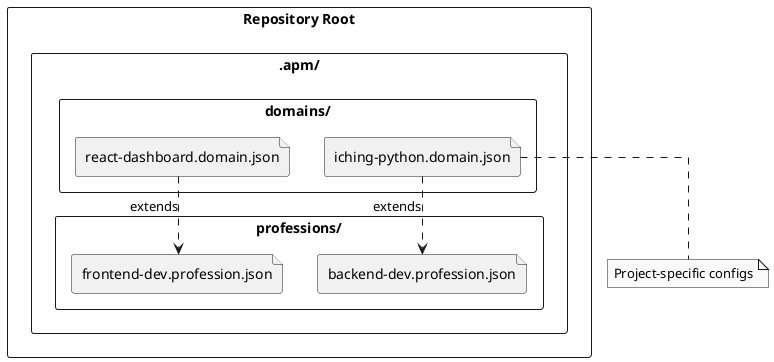

# 🚀 AIPromptManager: Status & Roadmap

**Last Updated:** 2026-01-22
**Current Version:** Phase 3.4 (Complete)
**Upcoming:** Phase 3.5 (Project/Domain Creation)

This document serves as a unified source of truth for the project's history, current state, and planned architectural decisions.

---

## 🏗️ 1. Project Overview

AIPromptManager is a desktop application designed to manage, version, and assemble AI prompts for agentic workflows. It allows users to maintain a "Registry" of skills (prompts) and combine them into "Professions" (configurations) for specific agents.

### Core Terminology

| Term | Definition |
|------|------------|
| **Skill** | A single reusable asset (Guide, Space, Prompt) stored as a Markdown file. |
| **Registry** | The collection of all available skills scanned from the filesystem. |
| **Profession** | A configuration defining a specific role (e.g., "Backend Developer"), consisting of a selected set of skills. |
| **Domain** | *(Planned)* A specialized extension of a profession (e.g., "Backend Developer + I-Ching Expert"). |

---

## ✅ 2. Current Implementation (Phase 3.4)

We have completed **Phase 3.4: New Features & Architecture**. This phase focused on critical file management capabilities, UI refactoring, and stability improvements.

### Key Features Implemented

* **Archive & Restore Service:**
  * Backend logic to move files to a hidden `.archive/` directory, preserving structure.
  * Restore functionality to return files to their original location.
  * Context menu integrations for "Archive" and "Restore" with correct status updates.
* **File Management:**
  * **Move Files:** "Move to Folder..." context menu option with a dialog for destination selection.
  * **Intelligent Rename:** Renaming files updates the registry and handles metadata correctly.
* **Architecture & Refactoring:**
  * **Quick View:** Refactored into a unified `QuickViewDialog` shared by `RegistryPanel` and `ConfigPanel`.
  * **Permissive Scanning:** `RegistryService` tracks all `.md` files, labeling them as `VALID`, `UNRECOGNIZED`, or `PARSE_ERROR`.
* **Stability & Quality:**
  * Fixed severe memory leaks in UI tests.
  * Full `mypy` strict compliance and passing `pytest` suite.
  * Pre-push hooks ensuring code quality before commits.

---

## 🏛️ 3. Architectural Design Decisions

The following decisions have been made for the upcoming **Phase 3.4** and beyond.

### 3.1 Profession & Domain Storage

To support project-specific configurations, we will adopt a structured approach within the AI library repository.

**Location:** `.apm/` folder in the root of the library (e.g., `AIPromptManager/.apm/`).

**Structure:**

* **`professions/`**: Contains "Base Roles".
  * Example: `backend-dev.profession.json`
  * Includes: Core skills (coding standards, git) + Platform skills (Python, Docker).
* **`domains/`**: Contains "Specialized Extensions".
  * Example: `iching-python.domain.json`
  * **Extends**: `backend-dev` (Inherits all skills from the profession).
  * **Includes**: Domain-specific skills (I-Ching Hexagrams logic, specific library docs).
* **User Workflow**: A user's project will reference a single **Domain** file, which transitively includes the Profession and all necessary Skills.

### 3.2 Archive System

Deleted skills are not effectively removed; they are moved to an Archive.

* **Directory:** `.archive/` (hidden folder in repo root).
* **Structure:** Mirrors the original directory structure.
  * Original: `prompts/coding/PROMPT-1-0-Refactor.md`
  * Archived: `.archive/prompts/coding/PROMPT-1-0-Refactor.md`
* **Behavior:** Archived skills are hidden by default but can be toggled visible. They are read-only until restored.

---

## 🗺️ 4. Roadmap (Phase 3.5 & Beyond)

### Phase 3.5: Profession & Domain Design (Next)

* **Refine Profession Creation:** Improve the UI/UX for creating, editing, and validating professions.
* **Project/Domain Design & Implementation:**
  * Design the data structure and storage for Domains (extending Professions).
  * Implement the UI for creating and managing Domains.
  * Establish inheritance logic (Domain extends Profession).

### Future Considerations

### Phase 3.5: Editor Integration

* **"Open with..."**: Integration with VS Code, Notepad++, etc.
* **Live Reload**: Watchdog observer to auto-refresh registry on file changes (no manual Refresh needed).

### Phase 4.0: Project Generation

* **`agent.config.json` Generation**: The final step where the selected Domain + Profession is compiled into the `.agent/rules` for the user's project.
* **Conflict Detection**: Warning if multiple skills define conflicting instructions.

---

## 📂 Key Documentation Links

* [Phase 3.4 Plan](file:///c:/Git/AIPromptManager/doc/plans/PLAN-Phase3.4-NewFeatures.md)
* [State Snapshot (2026-01-20)](file:///c:/Git/AIPromptManager/doc/plans/state_20260120_transfer.md)
* [Getting Started Guide](file:///c:/Git/AIPromptManager/sample_data/prompts/GUIDE-1-0-Getting-Started.md)
