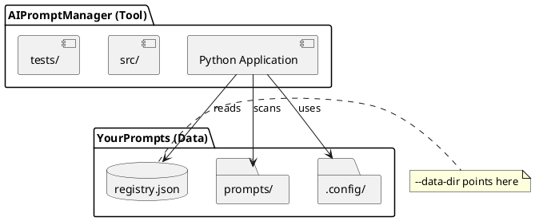
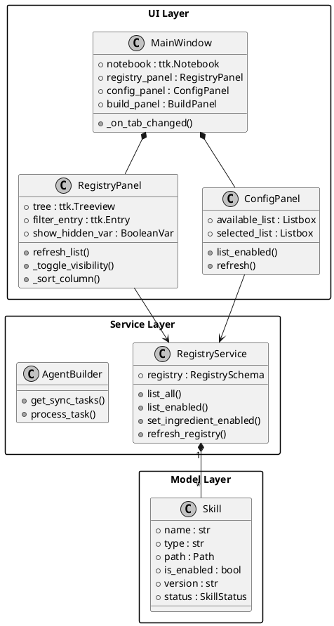

# AIPromptManager

> **A Python desktop application for managing AI prompt libraries with knowledge base, profession designer, and agent onboarding features.**

[](https://opensource.org/licenses/Apache-2.0)
[](https://www.python.org/downloads/)

---

## 🎯 What is AIPromptManager?

**AIPromptManager** is a standalone desktop tool for managing AI prompt libraries. It helps you:

1. **Organize** prompt files in a searchable knowledge base
2. **Select** which prompts to include in different projects (professions)
3. **Build** project-specific `.agent/` folders automatically
4. **Manage** versions, visibility, and metadata

**Separation of Concerns**: AIPromptManager is the **tool** repository. Your prompt library lives in a separate **data** repository (like `AiPrompts`). You run the tool and point it at your data:

```bash
python src/main.py --data-dir c:\Path\To\YourPrompts
```

---

## 🏗️ Architecture

### Repository Separation




### Application Architecture




---

## 🚀 Use Cases

### Use Case 1: Using AIPromptManager with Your Prompt Library

**Scenario**: You have a collection of AI prompts and want to manage them visually.

**Steps**:

1. Clone AIPromptManager
2. Run with your data directory: `python src/main.py --data-dir c:\MyPrompts`
3. The tool catalogs your prompts in the Knowledge Base
4. Use Profession Designer to create skill selections
5. Build agent configurations for different projects

### Use Case 2: Starting from Sample Data

**Scenario**: You want to try AIPromptManager before creating your own library.

**Steps**:

1. Clone AIPromptManager
2. Run without arguments: `python src/main.py`
3. Explore the `sample_data/` prompts
4. Modify sample prompts to understand the structure
5. Copy `sample_data/` as a template for your own library

### Use Case 3: Managing Visibility

**Scenario**: You have experimental prompts you don't want in production builds.

**Steps**:

1. Open Knowledge Base tab
2. Right-click experimental prompts → **Hide**
3. Hidden prompts are greyed out and excluded from Profession Designer
4. Use "Show Hidden" toggle to manage visibility
5. Build agents - only enabled prompts are included

### Use Case 4: Syncing Updates

**Scenario**: You've updated a prompt and want to refresh it in a project.

**Steps**:

1. Edit the source file in your data repository
2. Run Agent Onboarding → Build Agent
3. Tool detects "Source is newer" → shows Update Available dialog
4. Review changes, choose Overwrite to update
5. Project now has the latest version

### Use Case 5: Archiving Skills

**Scenario**: You have obsolete prompts that you want to remove from view but keep for history.

**Steps**:

1. Select skills in Knowledge Base
2. Right-click → **Archive Skills**
3. Skills are moved to `.archive/` folder and hidden
4. Enable "Show Archived" checkbox to view them
5. Right-click archived skills → **Restore Skills** to bring them back

---

## 📁 Key Components

| Component | Description |
|-----------|-------------|
| `registry.json` | Catalog of all skills (name, path, description, visibility) |
| `agent.config.json` | Per-project configuration specifying which skills to include |
| `.agent/rules/` | Built output folder with version-less filenames |
| `.config/conventions.json` | File naming patterns (in data repository) |

---

## 🔧 Features

### Knowledge Base Panel

- View all available skills
- **Filter** by name or path (real-time search)
- **Sort** by clicking column headers (Type, Name, Path, Status)
- **Toggle Visibility** with context menu (Hide/Show)
- **Quick View** popup for previewing content
- **Show Hidden** checkbox to reveal greyed-out items
- **Show Archived** checkbox to reveal archived items (stored in `.archive/`)
- **Status Indicators**: ✓ Valid, ⚠️ Unrecognized, ❌ Parse Error, 📦 Archived
- **Compare Selected**: Launch external merge tool (2-way/3-way support)
- **Context Actions**: Show in Explorer, Open with Editor, Open with Notepad, Move to Folder

### Profession Designer

- **Available** list shows all enabled skills
- **Selected** list shows chosen skills for this profession
- Use arrow buttons to move items between lists
- Hidden skills are automatically excluded
- Save selections as `agent.config.json`

### Agent Onboarding

- Select a profession config file (JSON)
- Choose an output directory
- **Build Agent** to create `.agent/rules/` folder
- **Bidirectional Sync** with conflict detection:
  - **Update Available**: Source file is newer
  - **Local Changes**: Target file is newer
- External diff tool integration (P4Merge, Beyond Compare)

### Version Management

- Versioned source files (e.g., `GUIDE-1-0-Name.md`)
- Version-less output files (e.g., `GUIDE--Name.md`)
- **Intelligent Metadata Extraction** using priority system:
  1. Filename pattern matching
  2. H1 heading extraction
  3. YAML frontmatter parsing
  4. Sensible defaults for unrecognized files

### File Format Support

- Markdown files (`.md`)
- YAML files (`.yaml`, `.yml`)

### Safety Features

- Timestamp-based change detection
- User confirmation before overwrites
- Interactive dialogs for conflict resolution
- Support for pushing local changes back to source

---

## 🛠️ Technology Stack

- **Python 3.10+** with strict type hints (`mypy --strict` compliant)
- **Plain tkinter** for native cross-platform UI
- **structlog** for structured logging
- **pytest** for testing (201 tests, 100% pass rate)
- **Apache 2.0 License**

---

## 📦 Command-Line Usage

```bash
# Run with sample data (default)
python src/main.py

# Run with custom data directory
python src/main.py --data-dir c:\Git\AiPrompts

# Run with relative path
python src/main.py --data-dir ../MyPrompts
```

**Data Directory Requirements**:

- Must contain `registry.json` (created automatically if missing)
- Prompts should have frontmatter with `type` and `version`
- Optional `.config/conventions.json` for naming patterns

---

## 📖 Sample Data Structure

The included `sample_data/` demonstrates the expected structure:

```
sample_data/
├── registry.json          # Ingredient catalog
├── .config/
│   └── conventions.json   # Naming patterns
├── prompts/
│   ├── GUIDE-1-0-Getting-Started.md
│   ├── SPACE-1-0-Web-Development.md
│   └── PROMPT-1-0-Code-Review.md
└── .agent/
    └── rules/             # Build output directory
```

**Sample Frontmatter**:

```markdown
---
version: "1.0"
type: GUIDE
---

# Your Prompt Title

Content goes here...
```

---

## 🧪 Testing & Development

```bash
# Run all tests
pytest tests/ -v

# Type check
mypy --strict src/

# Format code
black src/ tests/
```

**Test Coverage**: 201 tests covering models, repositories, services, and UI logic.

---

## 🤝 Contributing

See [CONTRIBUTING.md](CONTRIBUTING.md) for development setup, code standards, and PR process.

---

## 📄 License

Apache License 2.0 - see [LICENSE](LICENSE) for details.

Copyright 2026 zzt108

---

## 🔗 Links

- **Repository**: <https://github.com/zzt108/AIPromptManager>
- **Issues**: <https://github.com/zzt108/AIPromptManager/issues>
- **Installation**: See [README.md](../README.md)
