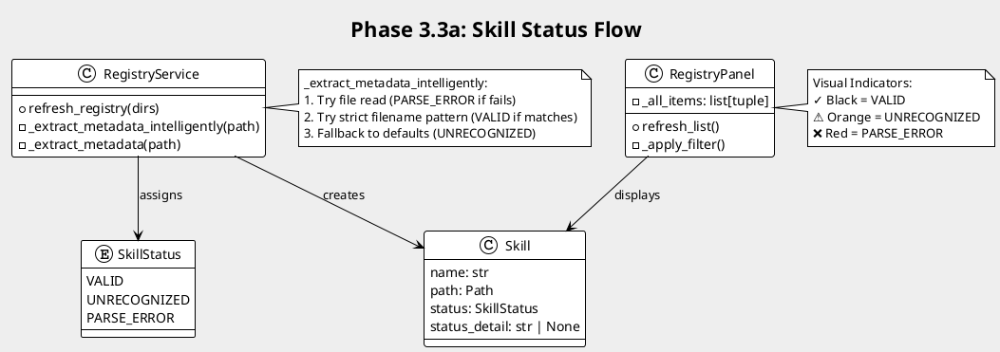
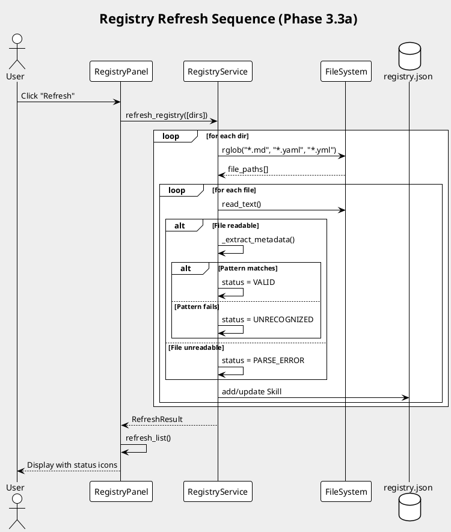

# Phase 3.3a Architecture Diagram

## Skill Model Status Flow

```plantuml
@startuml
!theme plain
skinparam backgroundColor #EEEEEE

title Phase 3.3a: Skill Status Flow

enum SkillStatus {
  VALID
  UNRECOGNIZED
  PARSE_ERROR
}

class Skill {
  name: str
  path: Path
  status: SkillStatus
  status_detail: str | None
}

class RegistryService {
  +refresh_registry(dirs)
  -_extract_metadata_intelligently(path)
  -_extract_metadata(path)
}

class RegistryPanel {
  +refresh_list()
  -_apply_filter()
  -_all_items: list[tuple]
}

RegistryService --> Skill : creates
RegistryService --> SkillStatus : assigns
RegistryPanel --> Skill : displays

note right of RegistryService
  _extract_metadata_intelligently:
  1. Try file read (PARSE_ERROR if fails)
  2. Try strict filename pattern (VALID if matches)
  3. Fallback to defaults (UNRECOGNIZED)
end note

note right of RegistryPanel
  Visual Indicators:
  ✓ Black = VALID
  ⚠️ Orange = UNRECOGNIZED
  ❌ Red = PARSE_ERROR
end note

@enduml
```

## Registry Refresh Sequence

```plantuml
@startuml
!theme plain
skinparam backgroundColor #EEEEEE

title Registry Refresh Sequence (Phase 3.3a)

actor User
participant "RegistryPanel" as UI
participant "RegistryService" as Svc
participant "FileSystem" as FS
database "registry.json" as Reg

User -> UI: Click "Refresh"
UI -> Svc: refresh_registry([dirs])

loop for each dir
  Svc -> FS: rglob("*.md", "*.yaml", "*.yml")
  FS --> Svc: file_paths[]
  
  loop for each file
    Svc -> FS: read_text()
    alt File readable
      Svc -> Svc: _extract_metadata()
      alt Pattern matches
        Svc -> Svc: status = VALID
      else Pattern fails
        Svc -> Svc: status = UNRECOGNIZED
      end
    else File unreadable
      Svc -> Svc: status = PARSE_ERROR
    end
    Svc -> Reg: add/update Skill
  end
end

Svc --> UI: RefreshResult
UI -> UI: refresh_list()
UI --> User: Display with status icons

@enduml
```
