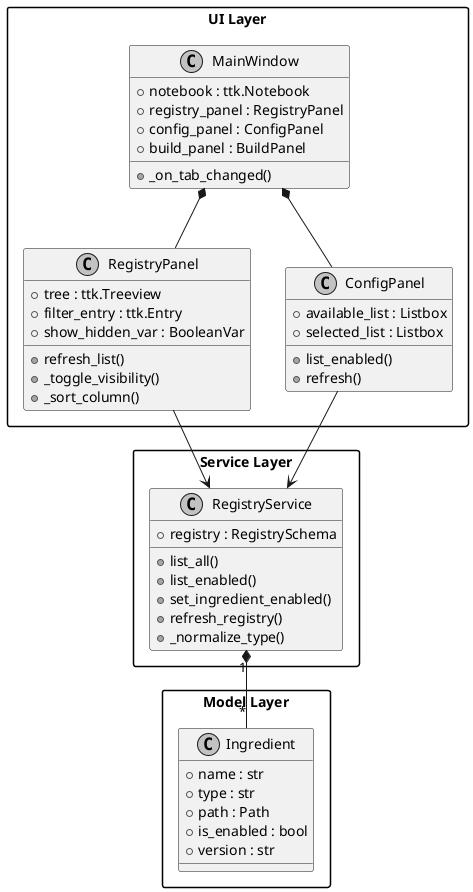

# Asset Manager Architecture (Phase 2.8)

```plantuml
@startuml
skinparam packageStyle rectangle
skinparam monochrome true

package "UI Layer" {
  class MainWindow {
    + notebook : ttk.Notebook
    + registry_panel : RegistryPanel
    + config_panel : ConfigPanel
    + build_panel : BuildPanel
    + _on_tab_changed()
  }

  class RegistryPanel {
    + tree : ttk.Treeview
    + filter_entry : ttk.Entry
    + show_hidden_var : BooleanVar
    + refresh_list()
    + _toggle_visibility()
    + _sort_column()
  }

  class ConfigPanel {
    + available_list : Listbox
    + selected_list : Listbox
    + list_enabled()
    + refresh()
  }
}

package "Service Layer" {
  class RegistryService {
    + registry : RegistrySchema
    + list_all()
    + list_enabled()
    + set_ingredient_enabled()
    + refresh_registry()
    + _normalize_type()
  }
}

package "Model Layer" {
  class Ingredient {
    + name : str
    + type : str
    + path : Path
    + is_enabled : bool
    + version : str
  }
}

MainWindow *-- RegistryPanel
MainWindow *-- ConfigPanel
RegistryPanel --> RegistryService
ConfigPanel --> RegistryService
RegistryService "1" *-- "*" Ingredient
@enduml
```

