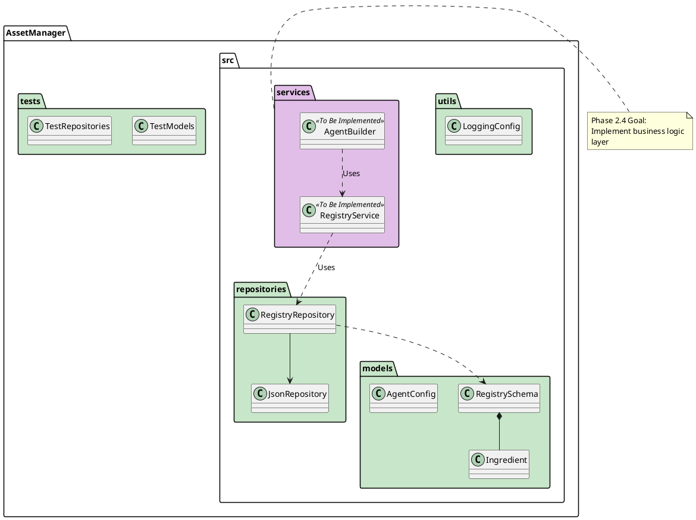

# 🚀 Context Transfer: AiPrompts Asset Manager

## 📍 Where We Are (Status)

* **Current Phase:** Phase 2.4 - AssetManager Services (Planning/Start)
* **Last Completed:** Phase 2.3 (Models & Repositories) - Implementation & Verification 100% Complete
* **In Progress:** Transitioning to Service Layer implementation
* **Next Up:** Implement `RegistryService` and `AgentBuilder`

## 📝 Task Status (`task.md` Snapshot)

```markdown
# Phase 2.3: AssetManager Core - Models & Repositories

## Models (`src/models/`)
- [x] `ingredient.py` - Ingredient dataclass
- [x] `registry_schema.py` - RegistrySchema class
- [x] `agent_config.py` - AgentConfig class

## Repositories (`src/repositories/`)
- [x] `json_repository.py` - Generic JSON I/O
- [x] `registry_repository.py` - Registry persistence

## Utils (`src/utils/`)
- [x] `logging_config.py` - Reusable structlog setup

## Tests (`tests/`)
- [x] `conftest.py` - Shared fixtures
- [x] `test_json_repository.py` - JSON repo tests
- [x] `test_registry_repository.py` - Registry repo tests
- [x] `test_models.py` - Model validation tests

## Project Setup
- [x] Create `src/` directory structure with `__init__.py` files
- [x] Create `pyproject.toml` with dependencies
- [x] Create `.vscode/tasks.json` for pytest/mypy
- [x] Verify tests pass with `pytest` (26/26 passed)
- [x] Verify strict type check passes with `mypy`

## Status
**Phase 2.3 COMPLETE** ✅
Ready to proceed to Phase 2.4 (Services Layer).
```

## 🧠 Key Context & Decisions

* **Architecture:** Clean Architecture (Models <- Repositories <- Services <- UI)
* **Import Strategy:** `pytest.ini` configured with `pythonpath = src` to allow direct `from models...` imports in tests.
* **Type Safety:** Strict `mypy` compliance enforced.
* **Workflows:**
  * Workflow files now versioned in filenames (e.g., `GIT-1-1-Generate-Commit-Message.md`).
  * `GIT-Generate-Commit-Message` outputs in code blocks with `+` bullets to prevent UI rendering issues.
* **Fixes Applied:**
  * Windows path separators in `Ingredient.to_dict()` fixed using `.as_posix()`.
  * `RegistrySchema` validation logic corrected to detect name mismatches.

## 📂 Hot Files (To Open First)

* `c:/Git/AiPrompts/.doc/plans/PLAN-1-3-AssetManager-Development.md` (Phase 2.4 Specs)
* `c:/Git/AiPrompts/AssetManager/src/models/ingredient.py` (Core Model)
* `c:/Git/AiPrompts/AssetManager/src/repositories/registry_repository.py` (Repo Base)

## ⏭️ Prompt for Next Session

*(Copy and paste this into the new chat)*

> "I am continuing work on AiPrompts Asset Manager. We just completed **Phase 2.3 (Models & Repositories)** and are ready to start **Phase 2.4 (Services Layer)**.
> Please review the attached `task.md` and the 'Hot Files' listed above.
>
> **Immediate Goal:** Implement `RegistryService` and `AgentBuilder` business logic as defined in PLAN-1-3."

## 🏗️ Visualization (Current State)


