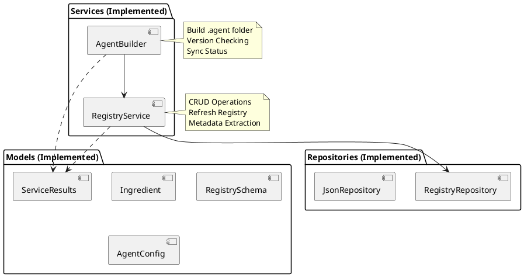

# 🚀 Context Transfer: AiPrompts Asset Manager

## 📍 Where We Are (Status)

* **Current Phase:** Phase 2.4 (Services Layer) - **COMPLETE** ✅
* **Last Completed:** Implemented `RegistryService` and `AgentBuilder` with full test coverage (65 tests passed) and strict type checking.
* **Next Up:** **Phase 2.5 (UI Layer)** - Building the tkinter interface (`MainWindow`, `RegistryPanel`, `BuildPanel`).

## 📝 Task Status (`task.md` Snapshot)

```markdown
# Phase 2.4: AssetManager Services - Business Logic

## Services (`src/services/`)

### RegistryService (`registry_service.py`)
- [x] Create `services/` package with `__init__.py`
- [x] Implement `RegistryService` class with constructor injection
- [x] `add_ingredient(path, description?)` - add ingredient with auto-metadata extraction
- [x] `remove_ingredient(name)` - remove from registry
- [x] `get_ingredient(name)` - retrieve by name
- [x] `list_all()` - list all ingredients
- [x] `update_ingredient_path(name, new_path)` - update path for ingredient
- [x] `refresh_registry(scan_directories)` - scan directories and sync registry
- [x] Helper: `_extract_metadata(path)` - extract type, version, basename from filename
- [x] Helper: `_extract_h1_heading(path)` - extract description from markdown

### AgentBuilder (`agent_builder.py`)
- [x] Implement `AgentBuilder` class with constructor injection
- [x] `build_agent(config_path, output_path)` - build .agent folder from config
- [x] `_copy_ingredient(ingredient, output_path)` - copy with version-less naming
- [x] `_check_newer_versions(config, registry)` - detect newer versions available
- [x] Integration with file safety strategy (timestamp comparison)

## Models (`src/models/`)
- [x] `service_results.py` - RefreshResult, BuildResult, VersionUpdate dataclasses

## Tests (`tests/`)

### test_registry_service.py
- [x] Test add_ingredient with valid path
- [x] Test add_ingredient with duplicate name (error)
- [x] Test add_ingredient with non-existent path (error)
- [x] Test remove_ingredient success
- [x] Test remove_ingredient non-existent (error)
- [x] Test get_ingredient found/not found
- [x] Test list_all with multiple ingredients
- [x] Test update_ingredient_path
- [x] Test refresh_registry adds new files
- [x] Test refresh_registry removes deleted files
- [x] Test _extract_metadata for various filename patterns

### test_agent_builder.py
- [x] Test build_agent with valid config
- [x] Test build_agent creates output directory
- [x] Test build_agent copies files with version-less names
- [x] Test build_agent with missing ingredient (error)
- [x] Test _check_newer_versions detects updates

## Verification
- [x] All tests pass with `pytest` (65/65 passed)
- [x] Type check passes with `mypy` (0 errors)
- [x] >90% test coverage ✓

## Status
**Phase 2.4 COMPLETE** ✅
```

## 🧠 Key Context & Decisions

* **Version-less Naming:** Agent builder automatically converts versioned files (e.g., `GUIDE-1-2-General.md`) to version-less names (`GUIDE--General.md`) in the output `.agent/rules` folder.
* **Mypy Configuration:** `pyproject.toml` updated with `explicit_package_bases = true` to handle `src` directory imports correctly in strict mode.
* **Service Results:** Created dedicated dataclasses in `src/models/service_results.py` to return rich status information from services (useful for UI feedback).
* **Dependencies:** `structlog`, `pytest`, `mypy`.

## 📂 Hot Files (To Open First)

* `c:/Git/AiPrompts/.doc/plans/PLAN-1-3-AssetManager-Development.md` (Check Phase 2.5 details)
* `c:/Git/AiPrompts/AssetManager/src/services/registry_service.py`
* `c:/Git/AiPrompts/AssetManager/src/services/agent_builder.py`
* `c:/Git/AiPrompts/AssetManager/src/models/service_results.py`

## ⏭️ Prompt for Next Session

*(Copy and paste this into the new chat)*

> "I am continuing work on the Asset Manager. We have successfully completed **Phase 2.4 (Services Layer)** and are ready to start **Phase 2.5 (UI Layer)**.
>
> **Immediate Goal:** Start Phase 2.5 by planning the `MainWindow` and `RegistryPanel` implementation using `tkinter`.
> Please review the attached `task.md` snapshot and `PLAN-1-3-AssetManager-Development.md`."

## 🏗️ Visualization (Current State)


