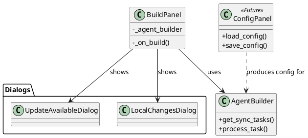

# 🚀 Context Transfer: AiPrompts Asset Manager

## 📍 Where We Are (Status)

* **Current Phase:** Phase 2.7 - Configuration UI
* **Last Completed:** Phase 2.6 - Build Panel & File Sync (verified 77/77 tests)
* **In Progress:** Planning Phase 2.7 (Config Panel design validated)
* **Next Up:** Implementing `ConfigPanel` (UI for visual `agent.config.json` creation)

## 📝 Task Status (`task.md` Snapshot)

```markdown
# Phase 2.6: Build Panel & File Sync (COMPLETED)

## BuildPanel UI (`src/ui/build_panel.py`)
- [x] UI Layout: Config selection (File Entry + Browse)
- [x] UI Layout: Output selection (Dir Entry + Browse)
- [x] Integration: Wire up "Build" button to `AgentBuilder`

## File Sync Logic (`src/services/agent_builder.py`)
- [x] Refactor `AgentBuilder` to support "Dry Run" / "Scan" phase
- [x] Implement `SyncStatus` detection
- [x] Implement `FileSafety` dialogs support

## Integration & Dialogs
- [x] Implement "Update Available" Dialog
- [x] Implement "Local Changes" Dialog
- [x] Connect Dialog results to `AgentBuilder` execution

## Verification
- [x] Automated Tests: `test_build_panel.py` & `test_agent_builder_sync.py` (Passed)
```

## 🧠 Key Context & Decisions

* **Interactive Sync Workflow:** The build process is "Scan (`get_sync_tasks`) -> Decide (Dialogs) -> Execute (`process_task`)".
* **Sync Types:** `SyncStatus` (Enum), `SyncAction` (Enum), `SyncTask` (Dataclass) are the core primitives.
* **UI Architecture:** `BuildPanel` manages the workflow. Dialogs (`UpdateAvailableDialog`, `LocalChangesDialog`) are modal `Toplevel` windows.
* **Testing Environment:** **CRITICAL:** Always use **PowerShell** for running tests/commands. `cmd.exe` hangs with python test runners. A bug report (`BUG-20260117-Terminal-Hang.md`) exists.
* **Testing Mocking:** `tkinter.TK` and `Toplevel` require careful mocking for headless tests. Use the `MockToplevel` stub pattern established in `test_sync_dialogs.py`.

## 📂 Hot Files (To Open First)

* `c:/Git/AiPrompts/AssetManager/src/ui/build_panel.py` (Integration point)
* `c:/Git/AiPrompts/AssetManager/src/services/agent_builder.py` (Core sync logic)
* `c:/Git/AiPrompts/AssetManager/src/models/agent_config.py` (Target model for next phase)
* `c:/Git/AiPrompts/.gemini/antigravity/brain/d88aa2e9-da4c-4fbc-8b7a-dd01959ba5ac/implementation_plan.md` (Contains Phase 2.7 plan)

## ⏭️ Prompt for Next Session

> "I am continuing work on Phase 2.7 (Configuration UI). We just completed Phase 2.6 (Build Panel & File Sync) and have verified all 77 tests.
> Please review the attached `implementation_plan.md` (Phase 2.7 section) and the 'Hot Files'.
>
> **Immediate Goal:** Create the `ConfigPanel` class in `src/ui/config_panel.py` to allow visual management of `agent.config.json`, including the 'Available' vs 'Selected' list logic."

## 🏗️ Visualization (Current State)


