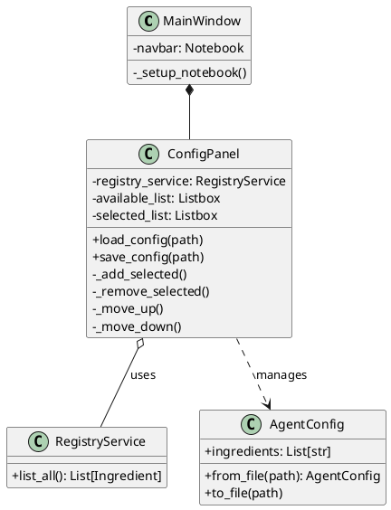

# 🚀 Context Transfer: AiPrompts Asset Manager

## 📍 Where We Are (Status)

* **Current Phase:** Phase 2.7 - Configuration UI
* **Last Completed:** Phase 2.6 - Build Panel & File Sync (verified 77/77 tests)
* **In Progress:** Starting implementation of `ConfigPanel`
* **Next Up:** Creating `src/ui/config_panel.py` and integration into `MainWindow`

## 📝 Task Status (`task.md` Snapshot)

```markdown
# Phase 2.7: Configuration UI

## ConfigPanel UI (`src/ui/config_panel.py`)
- [ ] Create `ConfigPanel` class with dual-listbox layout
- [ ] UI Layout: Available list (from Registry)
- [ ] UI Layout: Selected list (current config ingredients)
- [ ] UI Layout: Add/Remove buttons (`>>` / `<<`)  
- [ ] UI Layout: Move up/down buttons for ordering
- [ ] Load: `load_config(path)` from existing agent.config.json
- [ ] Save: `save_config(path)` to agent.config.json
- [ ] New/Clear: Reset selected list

## Integration (`src/ui/main_window.py`)
- [ ] Add ConfigPanel as third tab ("Config Editor")
- [ ] Wire up RegistryService for available ingredients

## Verification
- [ ] Automated Tests: `test_config_panel.py`
- [ ] Run pytest (77+ tests must pass)
- [ ] Run mypy --strict
```

## 🧠 Key Context & Decisions

* **UI Design:** The `ConfigPanel` implements a "Dual-Listbox" selection pattern.
* **Architecture:** `ConfigPanel` uses `RegistryService` to display available assets and `AgentConfig` model for persistence.
* **Unresolved Issue:** There is an active bug `BUG-20260117-Workflow-Menu-Missing.md` where the local workflow menu is not populated. Investigation suggests potential YAML parsing issues or index corruption in the local workspace.
* **Testing:** Using PowerShell is required to avoid `cmd.exe` hanging during tests.

## 📂 Hot Files (To Open First)

* `c:/Git/AiPrompts/AssetManager/src/ui/config_panel.py` (To be created)
* `c:/Git/AiPrompts/AssetManager/src/ui/main_window.py` (Integration point)
* `c:/Git/AiPrompts/AssetManager/src/models/agent_config.py` (Persistence model)
* `c:/Git/AiPrompts/AssetManager/src/services/registry_service.py` (Data source)

## ⏭️ Prompt for Next Session

*(Copy and paste this into the new chat)*

> "I am continuing work on Phase 2.7 (Configuration UI). We have just finalized the planning and are ready to implement the `ConfigPanel`.
> Please review the `implementation_plan.md` and `task.md` for Phase 2.7.
>
> **Immediate Goal:** Create the `ConfigPanel` class in `src/ui/config_panel.py` with the dual-listbox logic for managing `agent.config.json`."

## 🏗️ Visualization (Current State)


