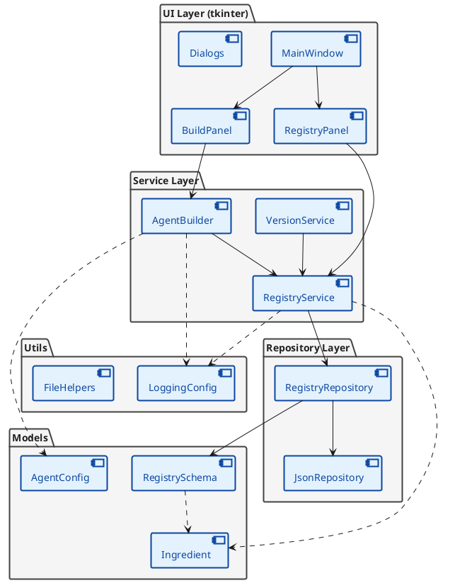
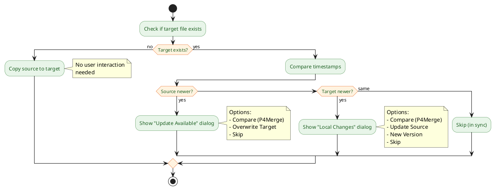
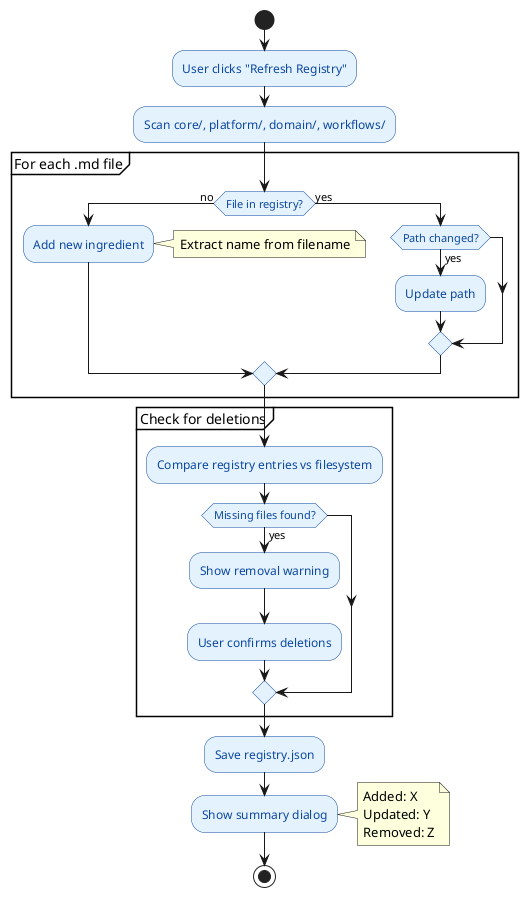
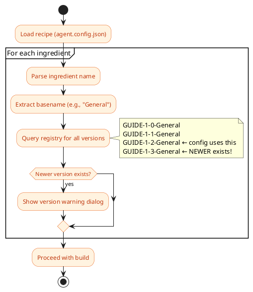
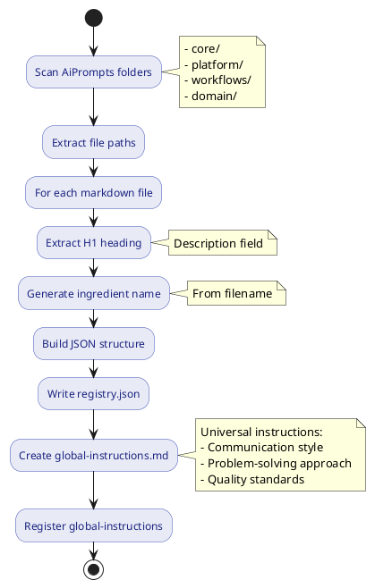
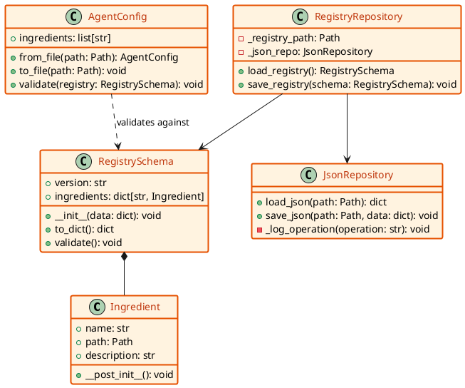
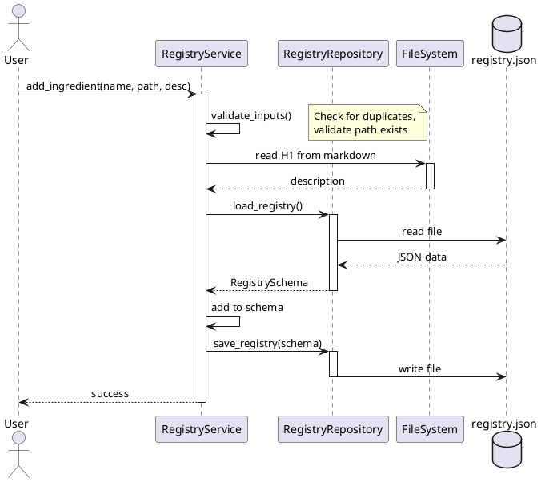
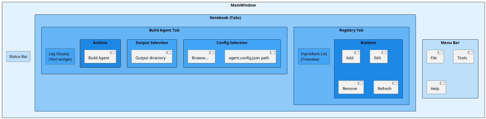
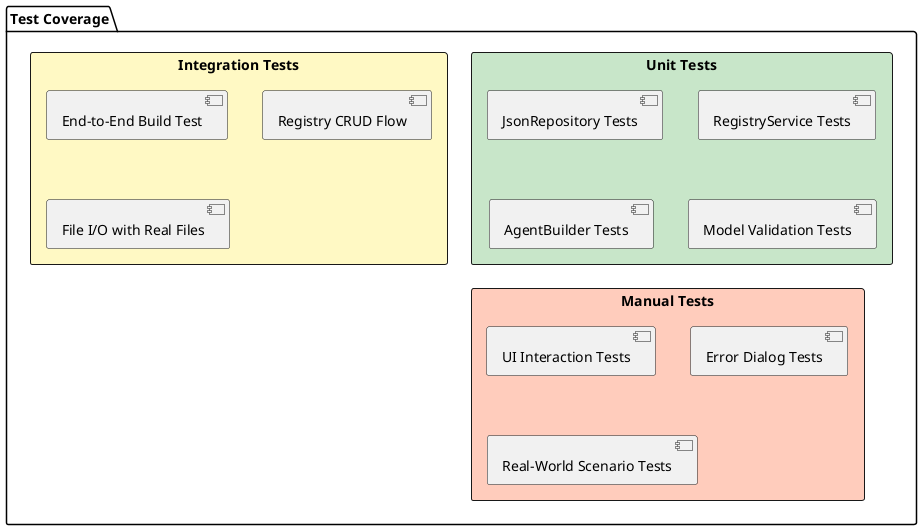

# PLAN-1-3: AssetManager Python Application Development

**Parent Plan**: PLAN-1-1-AiPrompts-AssetManager  
**Phase**: 2.3 - Build AssetManager Tooling  
**Date**: 2026-01-16  
**Status**: 📋 Planning

---

## Overview

Develop `AssetManager.py` - a Python desktop application for managing AiPrompts ingredients, version control, and building `.agent/` folders for client projects.

**Technology Stack**:

- Python 3.10+
- Plain tkinter (native UI)
- structlog (structured logging, reusable configuration)
- pytest (testing framework)

**Architecture Principles**:

- Clean architecture (models, repositories, services, UI)
- SOLID principles
- Dependency injection
- Comprehensive testing

---

## Architecture Overview



---

## File Safety Strategy

### Filename Convention

| Location | Format | Example |
|----------|--------|---------|
| Source (AiPrompts) | Versioned | `GUIDE-1-2-General.md` |
| Target (.agent/rules) | Version-less | `GUIDE--General.md` |

**Rationale**: Files in `.agent/rules/` reference each other using `--` (latest version) pattern. Version-less filenames ensure cross-references remain valid across updates.

### Sync Decision Workflow



### User Dialogs

#### Dialog A: Update Available (Source is Newer)

```
╔════════════════════════════════════════════════════════════╗
║  📥  Update Available                                      ║
╠════════════════════════════════════════════════════════════╣
║  File: GUIDE--General.md                                   ║
║                                                            ║
║  Source:  2026-01-16 14:30  ← NEWER                       ║
║  Target:  2026-01-15 09:15                                 ║
║                                                            ║
╠════════════════════════════════════════════════════════════╣
║  [Compare]   [Overwrite Target]   [Skip]   [Overwrite All] ║
╚════════════════════════════════════════════════════════════╝
```

**Actions**:

- **Compare**: Opens external diff tool (P4Merge) with target and source
- **Overwrite Target**: Copies source content to target, updates timestamp
- **Skip**: Keeps target unchanged, moves to next file
- **Overwrite All**: Applies overwrite to all remaining newer-source files

#### Dialog B: Local Changes Detected (Target is Newer)

```
╔════════════════════════════════════════════════════════════╗
║  ⚠️  Local Changes Detected                                ║
╠════════════════════════════════════════════════════════════╣
║  File: GUIDE--General.md                                   ║
║                                                            ║
║  Source:  2026-01-15 09:15                                 ║
║  Target:  2026-01-16 14:30  ← NEWER (modified locally!)   ║
║                                                            ║
║  You have local changes that are not in the source.        ║
║                                                            ║
╠════════════════════════════════════════════════════════════╣
║  [Compare]  [Update Source]  [New Version]  [Skip]         ║
╚════════════════════════════════════════════════════════════╝
```

**Actions**:

- **Compare**: Opens external diff tool to review differences
- **Update Source**: Copies target content back to source file (in-place update)
- **New Version**: Creates new versioned file in source (e.g., `GUIDE-1-3-General.md`), updates registry
- **Skip**: Keeps both files unchanged

### External Diff Tool Configuration

The diff tool is configurable via settings:

```json
{
    "diff_tool": "C:\\Program Files\\Perforce\\p4merge.exe",
    "diff_tool_args": "{target} {source}"
}
```

**Default**: P4Merge (can be changed to Beyond Compare, WinMerge, etc.)

### Implementation Notes

1. **Timestamp comparison**: Uses file modification time (`st_mtime`)
2. **No manifest/hash required**: Timestamps are sufficient for change detection
3. **Bidirectional sync**: Recognizes both "pull updates" and "push local changes" scenarios
4. **User always decides**: No silent overwrites, even when source is newer

---

## Registry Management Strategy

### Scan Scope

The registry scanner only indexes files from these AiPrompts directories:

| Directory | Content Type |
|-----------|--------------|
| `core/` | Universal guides, conventions |
| `platform/` | Language/framework specific |
| `domain/` | Project-specific customizations |
| `workflows/` | Step-by-step procedures |

**Excluded**: Root files, `.doc/`, `tools/`, `tests/`, etc.

### Version Detection

Versions are extracted from **filenames** using the pattern:

```
{TYPE}-{MAJOR}-{MINOR}-{Name}.md
```

Examples:

- `GUIDE-1-2-General.md` → Version 1.2
- `GUIDE-1-3-General.md` → Version 1.3 (newer)
- `GUIDE--General.md` → Version-less (for cross-references)

**Future**: May also read version from YAML frontmatter or H1 heading.

### Registry Update Workflow



### Registry Entry Format

```json
{
    "version": "1.0",
    "ingredients": {
        "GUIDE-1-2-General": {
            "path": "core/GUIDE-1-2-General.md",
            "description": "General coding conventions and principles",
            "type": "GUIDE",
            "major": 1,
            "minor": 2,
            "basename": "General"
        }
    }
}
```

---

## Recipe Version Validation

### Recipe (agent.config.json) Format

Recipes reference **source files with version numbers**:

```json
{
    "name": "VecTool Python Project",
    "ingredients": [
        "GUIDE-1-2-General",
        "GUIDE-1-0-coding-convention-python",
        "SPACE-260111-AIPrompts-Python"
    ]
}
```

**Note**: Target filenames (`.agent/rules/`) are version-less and handled automatically by the build process.

### Version Check on Build



### Dialog: Newer Version Available

```
╔════════════════════════════════════════════════════════════╗
║  ⚠️  Newer Version Available                               ║
╠════════════════════════════════════════════════════════════╣
║  Ingredient: GUIDE-1-2-General                             ║
║                                                            ║
║  Your config uses:  1.2                                    ║
║  Latest available:  1.3  ← NEW                             ║
║                                                            ║
║  Would you like to update your recipe?                     ║
║                                                            ║
╠════════════════════════════════════════════════════════════╣
║  [Update to 1.3]  [Keep 1.2]  [Update All]  [Ignore All]   ║
╚════════════════════════════════════════════════════════════╝
```

**Actions**:

- **Update to 1.3**: Modifies agent.config.json to use newer version
- **Keep 1.2**: Uses current version, no warning again this session
- **Update All**: Updates all ingredients to latest versions
- **Ignore All**: Suppresses all version warnings this session

---

## Phase Breakdown

### Phase 2.1: Foundation & Planning ✅ (Current)

**Deliverables**:

- [x] This plan document with diagrams
- [ ] Reusable logging configuration pattern design
- [ ] Architecture validation

**Duration**: 1 session

---

### Phase 2.2: Quick Wins - registry.json & global-instructions.md

**Goal**: Create the foundational data files without requiring the full application.

**Deliverables**:

1. **registry.json**: Auto-generated catalog of all markdown files
2. **global-instructions.md**: Universal AI instructions for all projects

**Implementation Strategy**:



**Success Criteria**:

- `registry.json` exists with all markdown files cataloged
- Each ingredient has `name`, `path`, `description`
- `global-instructions.md` created and registered
- Manual verification: JSON is well-formed

**Duration**: 1 session

---

### Phase 2.3: AssetManager Core - Models & Repositories

**Goal**: Build the data layer and file I/O foundation.

**Class Diagram**:



**Deliverables**:

1. `models/ingredient.py` - Ingredient dataclass
2. `models/registry_schema.py` - Registry structure
3. `models/agent_config.py` - Config file schema
4. `repositories/json_repository.py` - Generic JSON I/O
5. `repositories/registry_repository.py` - Registry persistence
6. `utils/logging_config.py` - **Reusable** structlog setup
7. `tests/test_json_repository.py` - Repository tests

**Reusable Logging Pattern**:

```python
# utils/logging_config.py
def configure_logging(
    app_name: str,
    seq_url: str | None = None,
    log_level: str = "INFO"
) -> None:
    """
    Configure structlog for any Python project.
    
    Args:
        app_name: Application identifier for log context
        seq_url: Optional SEQ server URL (e.g., "http://localhost:5341")
        log_level: Logging level (DEBUG, INFO, WARNING, ERROR)
    """
    # Reusable across all future projects
```

**Success Criteria**:

- All models have type hints and docstrings
- JSON repository can load/save with error handling
- Registry repository validates schema
- Logging config is project-agnostic (can copy to other projects)
- All tests pass

**Duration**: 2 sessions

---

### Phase 2.4: AssetManager Services - Business Logic

**Goal**: Implement core workflows and business rules.

**Sequence Diagram - Add Ingredient Flow**:



**Deliverables**:

1. `services/registry_service.py` - CRUD operations
   - `add_ingredient(name, path, description)`
   - `remove_ingredient(name)`
   - `get_ingredient(name)`
   - `list_all()`
   - `update_ingredient_path(name, new_path)`
2. `services/version_service.py` - Version management
   - `bump_version(ingredient, create_new_file, bump_type)`
3. `services/agent_builder.py` - Agent folder builder
   - `build_agent(config_path, output_path)`
4. `tests/test_registry_service.py`
5. `tests/test_agent_builder.py`

**Success Criteria**:

- Services use constructor injection
- All operations logged with structured context
- Error handling with clear exceptions
- All tests pass with >90% coverage

**Duration**: 2 sessions

---

### Phase 2.5: AssetManager UI - tkinter Interface

**Goal**: Build the user interface for registry management and agent building.

**UI Mockup Flow**:



**Generated Mockups**:


**Deliverables**:

1. `ui/main_window.py` - Main application
   - Menu bar (File > Exit, Tools > Refresh Registry, Help > About)
   - Notebook with 2 tabs
   - Status bar for messages
2. `ui/panels/registry_panel.py` - Registry management
   - Treeview widget displaying ingredients
   - Add/Edit/Remove/Refresh buttons
   - Double-click to edit
3. `ui/panels/build_panel.py` - Agent builder
   - File/directory selection widgets
   - Build button
   - Log text widget for real-time output
4. `ui/dialogs/ingredient_dialog.py` - Add/Edit dialog
   - Name entry
   - Path entry with file browser
   - Description (auto-extracted or manual)
   - OK/Cancel
5. `main.py` - Entry point with dependency wiring

**Success Criteria**:

- UI launches without errors
- All buttons functional
- Dialogs work with validation
- Error messages displayed to user
- Log output visible in build panel

**Duration**: 2-3 sessions

---

### Phase 2.6: Testing & Verification

**Goal**: Comprehensive testing and end-to-end verification.

**Test Coverage Diagram**:



**Deliverables**:

1. Complete test suite with pytest
2. Manual test plan document
3. Verification checklist
4. Bug fixes from testing

**Test Scenarios**:

- Add ingredient via UI → verify in registry.json
- Build agent with 5 ingredients → verify files copied
- Edit ingredient path → verify registry updated
- Handle missing file gracefully
- Handle malformed JSON gracefully

**Success Criteria**:

- All automated tests pass
- Manual test plan executed successfully
- No critical bugs remain
- Application ready for real-world use

**Duration**: 1-2 sessions

---

## Technology Decisions

| Decision | Choice | Rationale |
|----------|--------|-----------|
| UI Framework | **Plain tkinter** | Native, no dependencies, sufficient for desktop tool |
| Logging | **structlog** | Structured logging, reusable config, SEQ integration |
| Testing | **pytest** | Standard Python testing, fixture support |
| Type Checking | **mypy strict** | Catch errors early, enforce type safety |
| Code Style | **Black formatter** | Consistent formatting, PEP-8 compliant |

---

## Reusability Strategy

**Logging Configuration** (`utils/logging_config.py`):

- Can be copied to any Python project
- Configuration via parameters (app_name, seq_url, log_level)
- Graceful fallback if SEQ unavailable

**Repository Pattern**:

- `JsonRepository` can be reused for any JSON-based storage
- Generic enough for other projects

**Service Layer Pattern**:

- Demonstrates clean architecture
- Template for future Python services

---

## Success Criteria (Overall)

- [ ] `registry.json` created and populated
- [ ] `global-instructions.md` created
- [ ] AssetManager.py application functional
- [ ] Can add/edit/remove ingredients via UI
- [ ] Can build `.agent/` folders from config
- [ ] All automated tests pass
- [ ] Logging configuration reusable
- [ ] Documentation complete (README, docstrings)
- [ ] Ready for Phase 3 (VecTool integration)

---

## Next Steps After Completion

1. **Phase 3**: Integrate with VecTool project
   - Add AiPrompts as submodule
   - Create agent.config.json
   - Test build workflow in real project
2. **Future Enhancements**:
   - Version bumping UI
   - Dependency chains
   - Tags and filtering
   - Export/import registry

---

**Estimated Total Duration**: 8-12 sessions across all phases
