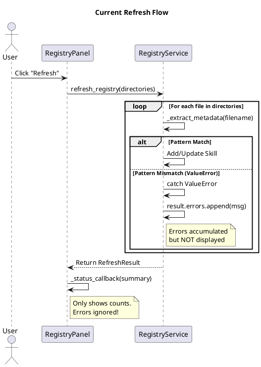
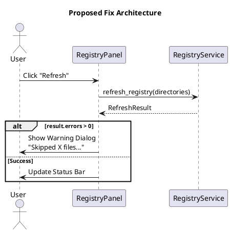

# System State: Registry Refresh Logic

## Current Refresh Flow (The "Silent Skip" Issue)

```plantuml
@startuml
title Current Refresh Flow

actor User
participant "RegistryPanel" as UI
participant "RegistryService" as Service

User -> UI: Click "Refresh"
UI -> Service: refresh_registry(directories)
loop For each file in directories
    Service -> Service: _extract_metadata(filename)
    alt Pattern Match
        Service -> Service: Add/Update Skill
    else Pattern Mismatch (ValueError)
        Service -> Service: catch ValueError
        Service -> Service: result.errors.append(msg)
        note right of Service: Errors accumulated\nbut NOT displayed
    end
end
Service --> UI: Return RefreshResult
UI -> UI: _status_callback(summary)
note right of UI: Only shows counts.\nErrors ignored!
@enduml
```

## Proposed Fix Architecture

```plantuml
@startuml
title Proposed Fix Architecture

actor User
participant "RegistryPanel" as UI
participant "RegistryService" as Service

User -> UI: Click "Refresh"
UI -> Service: refresh_registry(directories)
Service --> UI: RefreshResult

alt result.errors > 0
    UI -> User: Show Warning Dialog\n"Skipped X files..."
else Success
    UI -> User: Update Status Bar
end
@enduml
```
