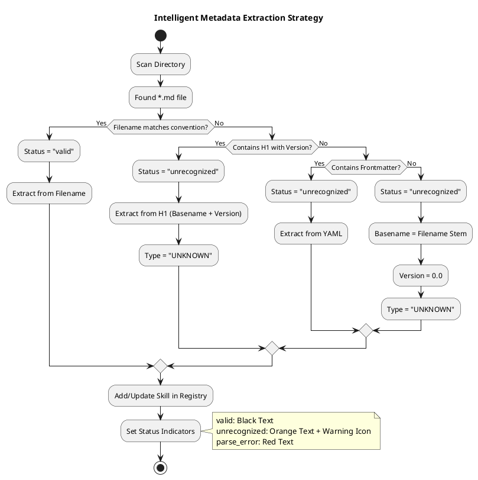
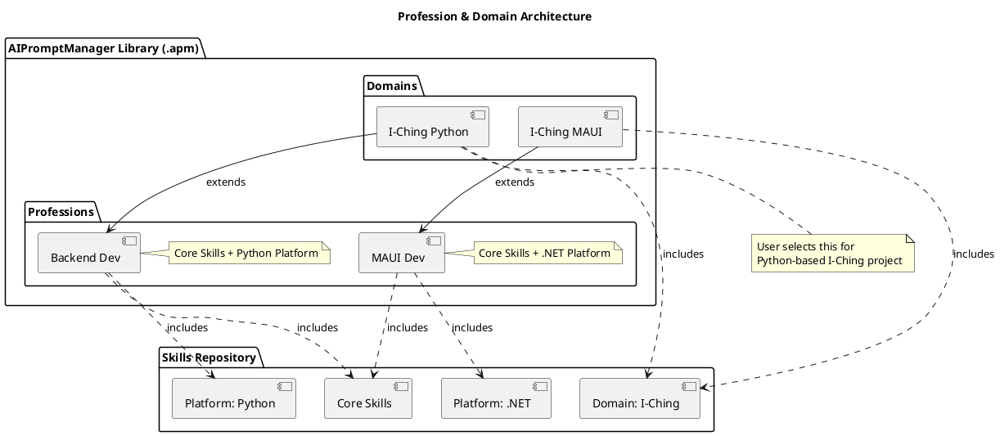

# Visualization: AIPromptManager State (2026-01-20)

## 1. Registry Filesystem View Logic (Phase 3.3a)

```plantuml
@startuml
title Intelligent Metadata Extraction Strategy

start
:Scan Directory;
:Found *.md file;

if (Filename matches convention?) then (Yes)
  :Status = "valid";
  :Extract from Filename;
else (No)
  if (Contains H1 with Version?) then (Yes)
    :Status = "unrecognized";
    :Extract from H1 (Basename + Version);
    :Type = "UNKNOWN";
  else (No)
    if (Contains Frontmatter?) then (Yes)
      :Status = "unrecognized";
      :Extract from YAML;
    else (No)
      :Status = "unrecognized";
      :Basename = Filename Stem;
      :Version = 0.0;
      :Type = "UNKNOWN";
    endif
  endif
endif

:Add/Update Skill in Registry;
:Set Status Indicators;
note right
  valid: Black Text
  unrecognized: Orange Text + Warning Icon
  parse_error: Red Text
end note

stop
@enduml
```

## 2. Future Architecture: Professions & Domains (Phase 3.4 Decision)

```plantuml
@startuml
title Profession & Domain Architecture

package "AIPromptManager Library (.apm)" {
  folder "Professions" {
    [Backend Dev] as P_Back
    note right: Core Skills + Python Platform
    
    [MAUI Dev] as P_Maui
    note right: Core Skills + .NET Platform
  }

  folder "Domains" {
    [I-Ching Python] as D_IChingPy
    [I-Ching MAUI] as D_IChingMaui
  }
}

package "Skills Repository" {
    [Core Skills]
    [Platform: Python]
    [Platform: .NET]
    [Domain: I-Ching]
}

P_Back ..> [Core Skills] : includes
P_Back ..> [Platform: Python] : includes

P_Maui ..> [Core Skills] : includes
P_Maui ..> [Platform: .NET] : includes

D_IChingPy --> P_Back : extends
D_IChingPy ..> [Domain: I-Ching] : includes

D_IChingMaui --> P_Maui : extends
D_IChingMaui ..> [Domain: I-Ching] : includes

note bottom of D_IChingPy
  User selects this for
  Python-based I-Ching project
end note

@enduml
```
